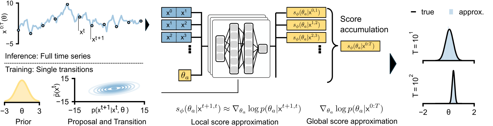

# Compositional simulation-based inference for time series

This is package implements methods for compositional simulation-based methods,
specifically for time series - or more precisly Markov processes. This specifically
is codebase accompanying the paper
"Compositional simulation-based inference for time series". Specifically, it implements
methods that utilize the Markov factorization of the likelihood to improve the efficiency
of simulation-based inference methods.



## Installation
We recommend installing the package in a virtual environment. To create a virtual environment
with conda, run the following command:
```bash
conda create -n markovsbi python=3.11
```

Withing the root directory of the package, run the following command:
```bash
pip install -e .
```
If you want to install the package on a CUDA enabled device, run the following command:
```bash
pip install -e .[cuda]
```
If you additionally want to install the packages associated with running the experiments, run the following command:
```bash
pip install -e .[bm]
```
Note: The intallation supports linux, and might require slight modifications for other operating systems (i.e torch cpu version).

## Usage

This will install the package and its dependencies. The package can be used to as a
normal python package called `markovsbi`. You can find a bunch of examples in the
`notebooks` folder.

If you installed it with the `bm` option, you can run the experiments from the command line.
Within your terminal of choice, you should be able to run the following command:
```bash
markovsbi --help
```
If this did not throw an error, it should show you all the available configuration options for all
implemented methods and experiments in the paper. If this did not work, please restart your terminal and
reinstall the package.

There are the following main configuration groups:
- `method`: What method to use e.g. "npe" as non-factorized baseline or "nle,nre,score" as the compositional method. Depending on the method, there are different options.
    - `neural_net`: Different neural network architectures.
    - `sampler`: Different sampling methods.
    - ... and many more
- `task`: The task to run the method on. This determines the training dataset.
- `eval`: The evaluation metric to use (and on how long the evaluation time series should be).

So from example, I can use
```bash
markovsbi method=score task=periodic_sde
```
to run a factorized score-based diffusion model. This will aim to infer the parameters of a periodic SDE.

As another example, I can use
```bash
markovsbi method=npe task=periodic_sde
```
to run a non-factorized neural posterior estimation model which also will aim to infer the parameters of a periodic SDE.

## Experiments

Most of the experiments in the paper equates to running the above command with the appropriate configuration.
You can find all the configuration files in `markovsbi/config/experiments`. This usually involves running a
lot of jobs, hence by default the package wants to use `slurm` via hydras `submitit` plugin. If you want to run
the experiments locally you can change the launcher via `launcher=local`. If you want use slrum you likely nned to
change the `partition` to your specific cluster configuration (in `markovsbi/config/partition`).

For example to run the baseline experiments for npe you can run the following command:
```bash
markovsbi +experiment=baseline_npe
```
on the other hand to run the compositional experiments for score-based models you can run the following command:
```bash
markovsbi +experiment=baseline_score
```
We recommend to run the experiments on a cluster, as there are many experiments to run. If you run them, the results
will be stored in the `results` folder and you can use further methods to analyze the results (see `figures`).

## Citation

If you use this package or related ideas in your research, please cite the following paper:
```
@misc{gloeckler2024compositionalsimulationbasedinferencetime,
      title={Compositional simulation-based inference for time series},
      author={Manuel Gloeckler and Shoji Toyota and Kenji Fukumizu and Jakob H. Macke},
      year={2024},
      eprint={2411.02728},
      archivePrefix={arXiv},
      primaryClass={cs.LG},
      url={https://arxiv.org/abs/2411.02728},
}
```
