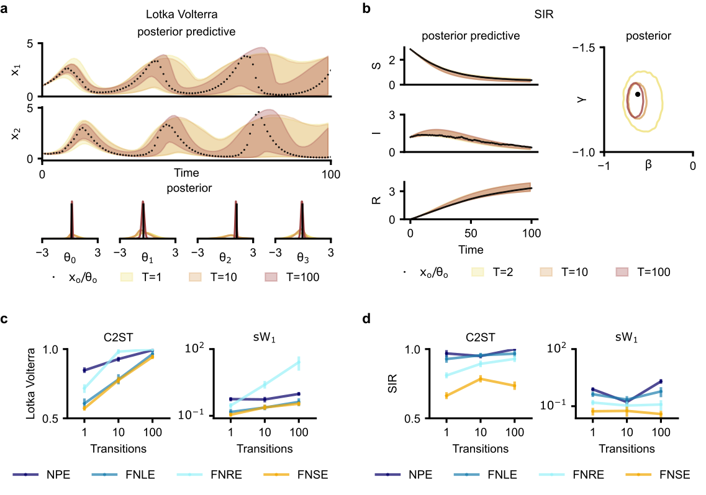

## Figure 3



This figure shows the results of the experiments for the Lotka volterra nd SIR task.

To reproduce the figure, the following experiments need to be run:
```bash
markovsbi +experiment=bm_lv_nle100k ;
markovsbi +experiment=bm_lv_nre100k ;
markovsbi +experiment=bm_lv_npe100k ;
markovsbi +experiment=bm_lv_score100k ;
markovsbi +experiment=bm_sir_nle100k ;
markovsbi +experiment=bm_sir_nre100k ;
markovsbi +experiment=bm_sir_npe100k ;
markovsbi +experiment=bm_sir_score100k ;
```

The subpanals are then produced in "fig_lv_and_sir.ipynb" and merged in "fig3.ipynb" using svgutil.
